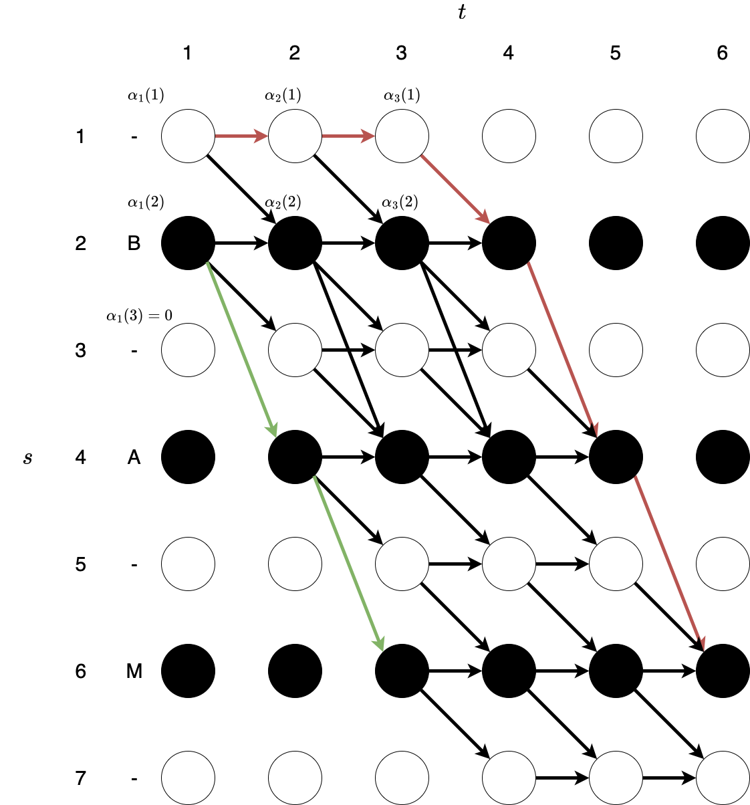
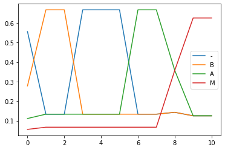
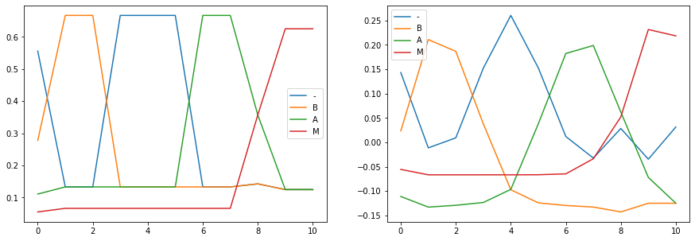

In this article we provide a detailed and explicit theoretical and subsequently practical explanination of connectionist temporal classification (CTC). Originally, CTC was introduced in [*Graves, A. et al 2006*](https://dl.acm.org/doi/pdf/10.1145/1143844.1143891). Since then, method has been applied in many SOTA speech recognition models ([*Wav2Vec2*](https://arxiv.org/pdf/2006.11477.pdf?fbclid=IwAR0UggIdWCosB9V00z1HqG0vohq7DZzZO_QjnqMXE-igvUWtWUJUq1AOB_w) etc.).

The following text provides a detailed explanation of the loss function and subsequently re-implements the function in python from the theoretical equations.
Overall the article is partitioned into the following sections:
* Theory
  * Speech recognition as temporal classification
  * Connectionist temporal classification as a likelihood function
  * Defining valid paths
  * The learning algorithm
    * The forward variable $$\alpha$$
    * The backward variable \( \beta \)
  * Towards a maximum likelihood function
  * The error function
* In practice
  * Setting up dummy prediction and target sequences
  * Calculating the forward variables \( \alpha \)
  * Calculating the sequence likelihood
  * Calculating the backward variables \( \beta \)
  * Calculating the gradients, and visualising error over time
  * Comparing result to `torch.nn.functional.CTCLoss`

`Numpy`, `matplotlib` and `torch` are required to run all the code, although `torch` will only be used as a comparison and is not a central requirement. 


```python
# preamble
import numpy as np
import matplotlib.pyplot as plt
import torch
```

## Speech recognition as temporal classification

The task of speech recognition can be seen as labelling a sequence of given spectral features (\( \boldsymbol{X}=\{\boldsymbol{x}^{(1)},\boldsymbol{x}^{(2)},\dots,\boldsymbol{x}^{(n_x)}\} \) of dimensionality \( (n_x,d) \), where \( n_x \) is the number of features in time, and \( d \) is the dimensionality of each spectral representation) from an audio clip, with the correct transcription \( \boldsymbol{y}=\{y^{(1)},y^{(2)},\dots,y^{(n_y)}\} \) where \( n_y \) is the number of orthographic units (characters,phonemes) in the target sequence (\( \boldsymbol{y} \)).

Specifically our task is to train some model \( f(\boldsymbol{X}) \) to produce framewise classifications \( \hat{\boldsymbol{Y}} \) for the input features \( \boldsymbol{X} \) such that: \( f(\boldsymbol{X}) \rightarrow \hat{\boldsymbol{Y}} \). Where \( \hat{\boldsymbol{Y}} \) has the same number of dimensions in time as \( \boldsymbol{X} \) but has \( d_y \) dimensions per vector, which represent all of the possible output classes, characters or phonemes. Therefore the scalar value \( \hat{y}=\hat{\boldsymbol{Y}}_{i,j} \) at any timestep \( 1 \leq i \leq n_y \) and position \( 1 \leq j \leq d \) is assosiated with the likelihood of predicting the output class \( j \) (character or phoneme) at that timestep \( i \).

If we sample the output predictions by, for example, taking the \( \text{argmax} \) over all the timesteps, such that we obtain:
\(  \)\hat{\boldsymbol{l}} = \text{argmax}_i \hat{\boldsymbol{Y}}\(  \)

Then we can calculate the edit distance for an example input \( (\boldsymbol{X} \) and transcription \( \boldsymbol{y}) \) using the function \( \text{ED}(\hat{\boldsymbol{l}},\boldsymbol{y}) \), where again \( \hat{\boldsymbol{l}} = \text{argmax}_if(\boldsymbol{X}) \).

## Connectionist temporal classification as a likelihood function

The CTC loss function expects the prediction vector \( \hat{\boldsymbol{y}}^{(i)} \) to be normalized, therefore each element is associated with a probability of an output class, typically characters, with an additional class for a blank character '\( - \)'.

Consequentially, we can the calculate the probability of observing a certain sequence of characters - defined as the path \( \boldsymbol{l}=\{l^{(1)},l^{(2)},\dots,l^{(n_i)}\} \) - through our prediction \( \hat{\boldsymbol{Y}}=\{\hat{\boldsymbol{y}}^{(1)},\hat{\boldsymbol{y}}^{(2)},\dots,\hat{\boldsymbol{y}}^{(n_y)}\} \) using:

\(  \)p(\boldsymbol{l}|\boldsymbol{X})=\prod_{i=1}^{n_i}\hat{y}^{(i)}_{l^{(i)}}\(  \)

Where the scalar \( \hat{y}^{(i)}_{l^{(i)}} \) is the probability assigned to character \( l^{(i)} \) at timestep \( i \).

## Defining valid paths

One of the fundamental challenges in speech recognition is the mistmatch between the length of input and output sequences (\( n_x \not= n_y \)), and the variance in the input features \( \boldsymbol{X} \) between speakers and dependency on the rate of speech.
The advantage to CTC is the simple two rule set which allow sequences variable len \( n_x \) to be matched to arbirtarty target sequences \( n_y \).

Given that we are constrained to predicting characters within the range "a-z", with an additional space character ("|").
We additionally add a blank character "-".

Then we define the following two rules to decode any labelling \( \boldsymbol{l} \):
1. Remove all adjoined repeated characters in a path \( \boldsymbol{l} \),
2. Then remove all blank characters "-".

This rule set is imposed by defining a mapping function \( \beta \) (which is a many-to-one mapping), which takes as input some labelling \( \boldsymbol{l} \), and returns the contracted form, for example: \( \beta(\boldsymbol{l}=\{\textit{bbbll-aa--m}\})=\beta(\boldsymbol{l}=\{\textit{blll-aa--mm}\})=\textit{blam} \)

Then the inverse of the many to one mapping \( \beta^{-1} \) can be used to determine the probability of a target sequence \( \boldsymbol{y} \) by summing the probabilities of all the valid paths (\( \boldsymbol{l} \)) which would result in the target sequence \( \beta(\boldsymbol{l})=\boldsymbol{y} \):

\(  \)p(\boldsymbol{y}|\boldsymbol{X})=\sum_{\boldsymbol{l}\in \beta^{-1}(\boldsymbol{y})} p(\boldsymbol{l}|\boldsymbol{X})\(  \)

## The learning algorithm

At first it seems that calculating the conditional probability \( p(\boldsymbol{y}|\boldsymbol{X}) \) will be computationally expensive, as there are many possible paths \( \boldsymbol{l} \) for a given target label \( \boldsymbol{y} \).

However, as we will see, the problem can be described recursively due to the dependency in valid paths for a given target label.
Therefore the problem can be solved using a dynamic programming method called the foward-backward algorithm.

Firstly \( \boldsymbol{y} \) is updated to include blank symbols between every variable as well as at the beginning and end of sequence \( \boldsymbol{y} \), such that \( \boldsymbol{y} =\{'-',y_1,'-',y_2,\dots,y_{n_y},'-'\} \) then \( n_y=n_y\cdot2 +1 \). This ensures that we include blanks in the possible valid paths.

Specifically lets consider the example target labelling \( \boldsymbol{y} =\{'-','B','-','A','-','M','-'\} \), and an input sequence with length \( n_x=6 \).
The diagram which follows is all the valid paths which would result in the correct target sequence \( \boldsymbol{y} \).
Note that the valid labelings include the path beginning and ending with a blank token.




The strategy is then to calculate the total probability for all the valid paths resulting in the target sequence \( \boldsymbol{y} \), this can be efficiently accomplished by calculating the forward and backward variables:

## Forward variable \( \alpha \)

We first define the forward variable \( \alpha \) as:

\(  \)\alpha_t(s)=\sum_{\boldsymbol{l}^{(1:t)} : \beta(\boldsymbol{l}^{(1:t)})=\boldsymbol{y}^{(1:s)}}\prod_{t'=1}^{t} \hat{y}^{(t')}_{\boldsymbol{l}^{(t')}}\(  \)

Where the sum is computed over all the paths \( \boldsymbol{l}^{(1:t)} \) which would result in target label \( \boldsymbol{y}^{(1:s)} \), and the product is computed up to the current timestep \( t \).

To initalise \( \alpha \) for \( t=1 \) is we utilise the following:

* \( \alpha_1(1)=\hat{y}_b^{(1)} \) Probabililty of blank at t=1,
* \( \alpha_1(2)=\hat{y}_{\boldsymbol{y}^{(1)}}^{(1)} \) Probability of first character in ground truth \( \boldsymbol{y}^{(1)} \),
* \( \alpha_1(s)=0  \) \( \forall s > 2 \).

Explicity this means we allow paths which begin with either a blank symbol \( \hat{y}_b^{(1)} \) or begin with the first target character \( \hat{y}_{\boldsymbol{y}^{(1)}}^{(1)} \), while all other paths are set to zero probability.

### A recursive formulation

We would like to obtain a recursive representation for \( \alpha \). Again, let us consider the diagram above.
Where the green path is the shortest route to produce BAM, and the red path is the longest valid path for \( t=6 \). The key observation here is that for a given target label \( y \) the forward variables \( \alpha_t(s) \) only ever depend on the previous forward variables \( \alpha_{t-1}(s) \), \( \alpha_{t-1}(s-1) \), or \( \alpha_{t-1}(s-2) \), while all other transition probabilities are 0 because they do not result in valid paths. 

According to the example (\( \boldsymbol{y}=\{'-',B,'-',A,'-',M,'-'\} \)) consider the following:
 * \( \alpha_1(1)=\hat{y}_b^{(1)} \) 
 * \( \alpha_1(2)=\hat{y}_{\boldsymbol{y}^{(2)}}^{(1)} \) 
 * \( \alpha_1(3),\alpha_1(4),\alpha_1(5),\alpha_1(6),\alpha_1(7)= 0 \) 
 * \( \alpha_2(1)=\hat{y}_b^{(1)} \cdot \hat{y}_b^{(2)} = \alpha_1(1) \cdot \hat{y}_b^{(2)} \)
 * \( \alpha_2(2)= \hat{y}_{\boldsymbol{y}^{(2)}}^{(1)} \cdot \hat{y}_{\boldsymbol{y}^{(2)}}^{(1)} + \hat{y}_{\boldsymbol{y}^{(2)}}^{(1)} \cdot \hat{y}_{b}^{(1)} = (\alpha_1(2) + \alpha_1(1)) \cdot \hat{y}_{\boldsymbol{y}^{(2)}}^{(1)}  \)
 * \( \alpha_2(4)= \hat{y}_{\boldsymbol{y}^{(2)}}^{(1)} \cdot \hat{y}_{\boldsymbol{y}^{(4)}}^{(2)} \) 

Generalising \( \alpha_2(2) \) above:
\(  \)\alpha_t(s)= (\alpha_{t-1}(s) + \alpha_{t-1}(s-1)) \cdot \hat{y}_{\boldsymbol{y}^{(t)}}^{(t)} \(  \)

Note that for jumps between non-blanks (i.e. \( \alpha_2(4) \) above: B (s=2) -> A (s=4)) there is an additional term in the recursive form:

\(  \)\alpha_t(s)= (\alpha_{t-1}(s) + \alpha_{t-1}(s-1) + \alpha_{t-1}(s-2)) \cdot \hat{y}_{\boldsymbol{y}^{(t)}}^{(t)} \(  \)

## Backward variable \( \beta \)

Similarly, the backward variable is defined as:

\(  \)\beta_t(s)=\sum_{\boldsymbol{l}^{(t:n_x)}:\beta(\boldsymbol{l}^{(t:n_x)})=\boldsymbol{y}^{(s:n_y)}} \prod_{t'=t}^{n_x}\hat{y}^{(t')}_{\boldsymbol{l}^{(t')}}\(  \)

Then the initialisations for final timestep \( t=n_x \):
* \( \beta_t(n_y) = \hat{y}_b^{(n_y)} \) Probability of final token being blank
* \( \beta_t(n_y - 1) = \hat{y}^{(n_y)}_{\boldsymbol{y}^{(t')}} \) Probability assigned to final character in target sequence
* \( \beta_t(s) = 0 \) \( \forall s < n_y - 1 \)

Then similar to the forward variable, the backward variable has the following two recursive form:

\(  \)
\beta_t(s) = \left\{
\begin{matrix}
(\beta_{t+1}(s) + \beta_{t+1}(s+1)) \cdot \hat{y}_{\boldsymbol{y}^{(t')}}^{(t)} \quad \quad  \text{for blank or same characters,}
\\
(\beta_{t+1}(s) + \beta_{t+1}(s+1) + \beta_{t+1}(s+2) )  \cdot \hat{y}_{\boldsymbol{y}^{(t')}}^{(t)} \quad \quad \quad \text{otherwise}
\end{matrix} \right.
\(  \)

## Towards a maximum likelihood function

Our ultimate aim is to formulate these two functions as a method to estimate the likelihood of a given sequence from some model prediction.
Towards this end, we multiply the forward and backward variables:

\(  \)
\begin{align*}
\alpha_t(s) \beta_t(s) &  = 
\sum_{\boldsymbol{l}^{(1:t)} : \beta(\boldsymbol{l}^{(1:t)})=\boldsymbol{y}^{(1:s)}}\prod_{t'=1}^{t} \hat{y}^{(t')}_{\boldsymbol{l}^{(t')}}
\cdot 
\sum_{\boldsymbol{l}^{(t:n_x)}:\beta(\boldsymbol{l}^{(t:n_x)})=\boldsymbol{y}^{(s:n_x)}} \prod_{t'=t}^{n_x}\hat{y}^{(t')}_{\boldsymbol{l}^{(t')}}
\\
\alpha_t(s) \beta_t(s) & = 
\sum_{\boldsymbol{l}^{(1:T)} : \beta(\boldsymbol{l}^{(1:T)})=\boldsymbol{y}^{(1:n_y)}} \hat{y}^{(t)}_{\boldsymbol{l}^{(s)}} \prod_{t'=1}^{n_x} \hat{y}^{(t')}_{\boldsymbol{l}^{(t')}}
\\
\frac{\alpha_t(s) \beta_t(s)}{\hat{y}_{\boldsymbol{l}^{(s)}}^{(t)}}
& = 
\sum_{\boldsymbol{l} \in \beta^{-1}(\boldsymbol{y})}
\prod_{t'=1}^{n_x} \hat{y}^{(t')}_{\boldsymbol{l}^{(t')}} \\ 
& =
\sum_{\boldsymbol{l} \in \beta^{-1}(\boldsymbol{y})}
p(\boldsymbol{l}|\boldsymbol{X})
\end{align*}
\(  \)

Then for an entire sequence the likehood is given by:

\(  \)
p(\boldsymbol{l}|\boldsymbol{x})
=
\sum_{t=1}^{n_x} \sum_{s=1}^{n_y} 
\frac{\alpha_t(s)\beta_t(s)}{ \hat{y}_{\boldsymbol{l}^{(s)}}^{t} }
\(  \)

## The error function

Then the equation above can be treated as a likelihood estimate which we would like to maximise. Specifically we optimise the following function for an input target pair (\( \boldsymbol{X},\boldsymbol{Y} \)) by descending its gradient:

\(  \)
J(\boldsymbol{X},\boldsymbol{Y})
= -
\ln \left (
p (\boldsymbol{y} | \boldsymbol{X})
\right )
= -
\ln \left (
\sum_{t=1}^{n_x} \sum_{s=1}^{n_y} 
\frac{\alpha_t(s)\beta_t(s)}{ \hat{y}_{\boldsymbol{y}^{(s)}}^{t} }
\right )
\(  \)

Which when differentiated with respect to the softmax output \( \hat{y}^{(t)}_k \) is:

\(  \)
\begin{align*}
\frac{\partial J(\boldsymbol{X},\boldsymbol{Y})}{\partial \hat{y}^{(t)}_k} & =
- \frac{1}{p (\boldsymbol{y} | \boldsymbol{X})} \cdot
\frac{\partial}{\partial \hat{y}^{(t)}_k}
\left(
\sum_{t=1}^{n_x} \sum_{s=1}^{n_y} 
\frac{\alpha_t(s)\beta_t(s)}{ \hat{y}_{l^{(s)}}^{t} }
\right) \\
& = \frac{1}{ \left( \alpha_{n_x}(n_y) + \alpha_{n_x}(n_y - 1) \right) \cdot \left(\hat{y}^{(t)}_k \right)^2} \sum_{s \in \gamma} \alpha_t(s)\beta_t(s)
\end{align*}
\(  \)

Where \( \gamma \) is the set of all paths \( s \) which pass though label \( k \) at time \( t \), and the likelihood of sequence \( \boldsymbol{y} \) is given by \( p(\boldsymbol{y}|\boldsymbol{X})=\left( \alpha_{n_x}(n_y) + \alpha_{n_x}(n_y - 1) \right) \), which is the probability of the sequence ending with the last token in \( \boldsymbol{y} \) or a blank symbol.

If we would like to observe the error for the unnormlized likelihoods \( z^{(t)}_k \) then the derivative of the likelihood function becomes:

\(  \)
\begin{align*}
\frac{\partial J(\boldsymbol{X},\boldsymbol{Y})}{\partial z^{(t)}_k} & =
\hat{y}^{(t)}_k - \frac{\sum_{s \in \gamma} \alpha_t(s)\beta_t(s)}{\left( \alpha_{n_x}(n_y) + \alpha_{n_x}(n_y - 1) \right) \cdot \hat{y}^{(t)}_k}
\end{align*}
\(  \)

## In practice

That is all the theory that we will need to practically code the CTC loss function. Like the formulation above, this section will provide detail with how to calculate the forward and backward variables, as well as estimate the likelihood and gradients. 

In order to show that our method actually calculates the correct we will compare our result to PyTorch's implementation, the C++ code can be found [here](https://github.com/pytorch/pytorch/blob/4abd3e299dd2d212047dcd5391bc404653afb94e/aten/src/ATen/native/LossCTC.cpp).

## Setting up dummy prediction and target sequences

In the subsequent code block we create a target sequence `y=BAM` which is one-hot encoded where:
* '-':0
* 'B':1
* 'A':2
* 'M':3

Additionally we create two dummy prediction matrices `Y_hat` and `Y_hat_uni`, where the former resembles a model whose predictions are somewhat accuracte, and the latter is uniformly distributed and resembles the predictions of an untrained model.


```python
BLANK_IDX = 0 # set blank index to zero

# create dummy target sequence (one-hot encoded)
Y = np.array([[1,0,0,0],
              [0,1,0,0],
              [1,0,0,0],
              [0,0,1,0],
              [1,0,0,0],
              [0,0,0,1],
              [1,0,0,0]])

# create dummy target sequence (ids)
Y_idx = np.argmax(Y,axis=-1)

# create dummy prediction matrix - resembling actual trained model predictions - currently unnormalised
Y_hat = np.array([[10,5,2,1],
                 [2,10,2,1],
                 [2,10,2,1],
                 [10,2,2,1],
                 [10,2,2,1],
                 [10,2,2,1],
                 [2,2,10,1],
                 [2,2,10,1],
                 [2,2,5,5],
                 [2,2,2,10],
                 [2,2,2,10]])

np.random.seed(42) # set numpy random seet

# create dummy prediction matrix - uniformly distributed (w. some noise)
Y_hat_uni = np.random.normal(1,1e-3,size=Y_hat.shape)

# create normalised probabilities over vocabulary
Y_hat = Y_hat / np.sum(Y_hat,axis=-1)[...,np.newaxis] 
Y_hat_uni = Y_hat_uni / np.sum(Y_hat_uni,axis=-1)[...,np.newaxis]

print(f"Y: {Y}\n")
print(f"Y_idx: {Y_idx}\n")
print(f"Y_hat: {Y_hat}\n")
print(f"Y_hat_uni: {Y_hat_uni}")
```

    Y: [[1 0 0 0]
     [0 1 0 0]
     [1 0 0 0]
     [0 0 1 0]
     [1 0 0 0]
     [0 0 0 1]
     [1 0 0 0]]
    
    Y_idx: [0 1 0 2 0 3 0]
    
    Y_hat: [[0.55555556 0.27777778 0.11111111 0.05555556]
     [0.13333333 0.66666667 0.13333333 0.06666667]
     [0.13333333 0.66666667 0.13333333 0.06666667]
     [0.66666667 0.13333333 0.13333333 0.06666667]
     [0.66666667 0.13333333 0.13333333 0.06666667]
     [0.66666667 0.13333333 0.13333333 0.06666667]
     [0.13333333 0.13333333 0.66666667 0.06666667]
     [0.13333333 0.13333333 0.66666667 0.06666667]
     [0.14285714 0.14285714 0.35714286 0.35714286]
     [0.125      0.125      0.125      0.625     ]
     [0.125      0.125      0.125      0.625     ]]
    
    Y_hat_uni: [[0.24996613 0.24980748 0.25000385 0.25022254]
     [0.24982415 0.24982415 0.25027728 0.25007443]
     [0.24993612 0.25018918 0.24993764 0.24993706]
     [0.2503082  0.24976886 0.249816   0.25010694]
     [0.24993543 0.25026745 0.24996165 0.24983548]
     [0.25037376 0.24995089 0.25002422 0.24965114]
     [0.24993943 0.25010331 0.24978773 0.25016952]
     [0.24982747 0.2499047  0.2498272  0.25044064]
     [0.2500885  0.24982735 0.25029759 0.24978655]
     [0.25023252 0.24968999 0.24984798 0.25022951]
     [0.25015378 0.25001202 0.24994028 0.24989392]]


### Predicitions over time

We can also visualise our predictions through time:


```python
x = np.arange(n_x)

plt.plot(x,Y_hat[:,0])
plt.plot(x,Y_hat[:,1])
plt.plot(x,Y_hat[:,2])
plt.plot(x,Y_hat[:,3])
plt.legend(["-","B","A","M"])

plt.show()
```


    

    


## Calculating the forward variables \( \alpha \)

Now we will implement code to calculate all the forward variables \( \alpha \) according to:

\(  \)
\beta_t(s) = \left\{
\begin{matrix}
\alpha_t(s)= (\alpha_{t-1}(s) + \alpha_{t-1}(s-1)) \cdot \hat{y}_{\boldsymbol{y}^{(t)}}^{(t)} \quad \quad  \text{for blank or same characters,}
\\
\alpha_t(s)= (\alpha_{t-1}(s) + \alpha_{t-1}(s-1) + \alpha_{t-1}(s-2)) \cdot \hat{y}_{\boldsymbol{y}^{(t)}}^{(t)} \quad \quad \quad \quad \text{otherwise}
\end{matrix} \right.
\(  \)

Recall the conditions for initialisations as laid out previously need to be implemented.


```python
n_x = Y_hat.shape[0] # time dimensions
n_y = Y.shape[0] # orthographic units (already includes blanks so 2 * n_y + 1)
alpha = np.zeros((n_x,n_y)) # create empty forward variables

# fill in defaults for alpha 0
alpha[0][0] = Y_hat[0][BLANK_IDX] # t = 0, s = 0
alpha[0][1] = Y_hat[0][Y_idx[1]] # t = 0, s = 1

for t in range(1,n_x): # for each of the input timesteps
    for s in range(n_y): # for each of the positions (s) in the target
        # dependency on same hypothesis s at prev timestep 
        alpha_tmin1_s = alpha[t-1][s]
        
        # once we have symbols in l then we track the dependency of alpha
        # on previous symbols i.e. alpha_{t-1}(s-1)
        if s > 0:
            alpha_tmin1_smin1 = alpha[t-1][s-1]
        else:
            alpha_tmin1_smin1 = 0.
        
        # once we have symbols in l then we can also track the 
        # dependency of alpha when new characters are added to the
        # sequence l i.e. if previous character (not blank) is not
        # the same as current character i.e. alpha_{t-1}(s-2)
        if s > 1 and Y_idx[s-2] != Y_idx[s]:
            alpha_tmin1_smin2 = alpha[t-1][s-2]
        else:
            alpha_tmin1_smin2 = 0.
        
        # apply rule from paragraph above eq.3 by disregarding
        # forward variables for timesteps which would not produce
        # a valid path
        if s <= n_y - 2 * (n_x - t) - 1:
            alpha[t,s] = 0.
        else:
            # otherwise calculate alpha according to the recursive form
            alpha[t,s] = (alpha_tmin1_s +
                          alpha_tmin1_smin1 + 
                          alpha_tmin1_smin2) * Y_hat[t][Y_idx[s]]
            
print(alpha)
```

    [[5.55555556e-01 2.77777778e-01 0.00000000e+00 0.00000000e+00
      0.00000000e+00 0.00000000e+00 0.00000000e+00]
     [7.40740741e-02 5.55555556e-01 3.70370370e-02 3.70370370e-02
      0.00000000e+00 0.00000000e+00 0.00000000e+00]
     [9.87654321e-03 4.19753086e-01 7.90123457e-02 8.39506173e-02
      4.93827160e-03 2.46913580e-03 0.00000000e+00]
     [6.58436214e-03 5.72839506e-02 3.32510288e-01 7.76954733e-02
      5.92592593e-02 6.09053498e-03 1.64609053e-03]
     [4.38957476e-03 8.51577503e-03 2.59862826e-01 6.23319616e-02
      9.13031550e-02 9.53635117e-03 5.15775034e-03]
     [2.92638317e-03 1.72071331e-03 1.78919067e-01 4.40947417e-02
      1.02423411e-01 1.08780979e-02 9.79606767e-03]
     [3.90184423e-04 6.19612864e-04 2.40853041e-02 1.49823015e-01
      1.95357537e-02 1.04930834e-02 2.75655540e-03]
     [5.20245897e-05 1.34639638e-04 3.29398892e-03 1.16351954e-01
      2.25811691e-02 1.19901235e-02 1.76661850e-03]
     [0.00000000e+00 2.66663183e-05 4.89804080e-04 4.27787797e-02
      1.98475891e-02 5.39011597e-02 1.96524885e-03]
     [0.00000000e+00 0.00000000e+00 0.00000000e+00 5.41190626e-03
      7.82829609e-03 7.28297053e-02 6.98330106e-03]
     [0.00000000e+00 0.00000000e+00 0.00000000e+00 0.00000000e+00
      0.00000000e+00 5.37936923e-02 9.97662579e-03]]


## Calculating the sequence likelihood

This is calculate according to the equation:

\(  \)p(\boldsymbol{y}|\boldsymbol{X})=\left( \alpha_{n_x}(n_y) + \alpha_{n_x}(n_y - 1) \right)\(  \)

as described above.


```python
# calculate the sequence liklelihood
likelihood = alpha[-1,n_y-1] + alpha[-1,n_y-2]

print(f"Likelihood: {likelihood:4f}")
print(f"Negative Log-Likelihood: {- np.log(likelihood):4f}")
```

    Likelihood: 0.063770
    Negative Log-Likelihood: 2.752467


## Calculating the backward variables \( \beta \)

Similar to the forward variables, this section implements the code for the backward variables:

\(  \)
\beta_t(s) = \left\{
\begin{matrix}
(\beta_{t+1}(s) + \beta_{t+1}(s+1)) \cdot \hat{y}_{\boldsymbol{y}^{(t')}}^{(t)} \quad \quad  \text{for blank or same characters,}
\\
(\beta_{t+1}(s) + \beta_{t+1}(s+1) + \beta_{t+1}(s+2) )  \cdot \hat{y}_{\boldsymbol{y}^{(t')}}^{(t)} \quad \quad \quad \text{otherwise}
\end{matrix} \right.
\(  \)


```python
n_x = Y_hat.shape[0] # time dimensions
n_y = Y.shape[0] # orthographic units (already includes blanks so 2 * n_y + 1)
beta = np.zeros((n_x,n_y)) # create empty backward variables

# fill in defaults for beta n_x
beta[-1][n_y-1] = Y_hat[-1][BLANK_IDX] # t = n_x, s = n_y (prob of blank)
beta[-1][n_y-2] = Y_hat[-1][Y_idx[-2]] # t = n_x, s = n_y - 1 (prob of last token)

for t in reversed(range(n_x-1)):
    for s in reversed(range(n_y)):
        # dependency on same hypothesis s at subsequent timestep 
        beta_tadd1_s = beta[t+1][s]
        
        # once we have symbols in l then we track the dependency of beta
        # on subsequent symbols i.e. beta_{t+1}(s+1)
        if s < (n_y - 1):
            beta_tadd1_sadd1 = beta[t+1][s+1]
        else:
            beta_tadd1_sadd1 = 0.
        
        # once we have symbols in l then we can also track the 
        # dependency of beta when new characters are added to the
        # sequence l i.e. if subsequent character (not blank) is not
        # the same as current character i.e. beta_{t+1}(s+2)
        if s < (n_y - 2) and (Y_idx[s+2] != Y_idx[s]):
            beta_tadd1_sadd2 = beta[t+1][s+2]
        else:
            beta_tadd1_sadd2 = 0.
        
        # apply rule from paragraph above eq.3 by
        # disregarding backward variables for timesteps
        # which would not produce a total output
        if s >= 2 * (t+1):
            beta[t,s] = 0.
        else:   
            beta[t,s] = (beta_tadd1_s + beta_tadd1_sadd1 + beta_tadd1_sadd2) * Y_hat[t][Y_idx[s]]
            
print(beta)
```

    [[4.45594265e-02 1.92108915e-02 0.00000000e+00 0.00000000e+00
      0.00000000e+00 0.00000000e+00 0.00000000e+00]
     [1.30483686e-02 6.71585991e-02 1.90838976e-03 9.22206937e-05
      0.00000000e+00 0.00000000e+00 0.00000000e+00]
     [1.14377888e-02 8.64249755e-02 1.38956092e-02 4.17313933e-04
      2.73454635e-04 8.86635313e-07 0.00000000e+00]
     [6.03630218e-02 2.54203939e-02 1.03138125e-01 1.07894474e-03
      2.04936802e-03 1.54174015e-06 1.17577895e-05]
     [5.45987654e-02 3.59457672e-02 1.49689153e-01 5.01803351e-03
      3.06856261e-03 5.48941799e-06 1.76366843e-05]
     [3.68386243e-02 4.50595238e-02 1.91501323e-01 3.30324074e-02
      4.54695767e-03 5.58862434e-05 2.64550265e-05]
     [4.56349206e-03 5.06944444e-02 4.63293651e-02 2.40922619e-01
      6.02182540e-03 7.98611111e-04 3.96825397e-05]
     [1.48809524e-03 3.27380952e-02 3.12500000e-02 3.16220238e-01
      3.34821429e-02 1.16815476e-02 2.97619048e-04]
     [0.00000000e+00 1.11607143e-02 1.11607143e-02 2.23214286e-01
      7.81250000e-02 1.72991071e-01 2.23214286e-03]
     [0.00000000e+00 0.00000000e+00 0.00000000e+00 7.81250000e-02
      7.81250000e-02 4.68750000e-01 1.56250000e-02]
     [0.00000000e+00 0.00000000e+00 0.00000000e+00 0.00000000e+00
      0.00000000e+00 6.25000000e-01 1.25000000e-01]]


## Calculating the gradients

Finally we can now calculate the gradients according to the equation:

\(  \)
\begin{align*}
\frac{\partial J(\boldsymbol{X},\boldsymbol{Y})}{\partial z^{(t)}_k} & =
\hat{y}^{(t)}_k - \frac{\sum_{s \in \gamma} \alpha_t(s)\beta_t(s)}{\left( \alpha_{n_x}(n_y) + \alpha_{n_x}(n_y - 1) \right) \cdot \hat{y}^{(t)}_k}
\end{align*}
\(  \)


```python
grad = np.zeros((n_x,Y_hat.shape[1])) # create empty gradient with shape (n_x,d)

for t in range(n_x):
    for s in range(n_y):
        # calculate the summation in the numerator of gradient equation
        # i.e. product of forward and backward variables for all t and s
        grad[t,Y_idx[s]] += alpha[t,s] * beta[t,s]
        
for t in range(n_x):
    for d in range(Y_hat.shape[1]):
        # calculate the gradients for each output class (d) at each timestep (t)
        # by including the remainder of the gradient equation
        grad[t,d] = (Y_hat[t][d] - (grad[t,d] / (likelihood * (Y_hat[t][d])  )))
        
print(grad)
```

    [[-0.14319314 -0.02347353  0.11111111  0.05555556]
     [ 0.01134552 -0.21094381  0.13293163  0.06666667]
     [-0.0092378  -0.18664138  0.12921303  0.06666615]
     [-0.15221124 -0.03792745  0.12347423  0.06666446]
     [-0.26053364  0.09733233  0.09654696  0.06665435]
     [-0.15276666  0.12421453 -0.03797154  0.06652367]
     [-0.01196009  0.12963911 -0.18237457  0.06469556]
     [ 0.0322354   0.13281493 -0.19877145  0.03372112]
     [-0.02843137  0.14282447 -0.06212332 -0.05226978]
     [ 0.03458807  0.125       0.071959   -0.23154707]
     [-0.03144623  0.125       0.125      -0.21855377]]


### Visually comparing loss over time versus likelihoods

This graph is somewhat equivalent to Figure 4.(b) in *Graves, A. et al 2006*.
In the figure, we can compare the locations where the 'model' has made predictions for the three relevant characters (B in 1-2, '-' for 3-5, then 'A' for 6-7, and finally 'M' for 9-10 ) and the localised errors (negative gradients) at those same time points, i.e. the loss encourages the prediction of those characters at those time points and discourages (negative values) predicting them for other time-points.


```python
x = np.arange(n_x)

fig, (ax1, ax2) = plt.subplots(1, 2,figsize=(15,5))

ax1.plot(x,Y_hat[:,0])
ax1.plot(x,Y_hat[:,1])
ax1.plot(x,Y_hat[:,2])
ax1.plot(x,Y_hat[:,3])
ax1.legend(["-","B","A","M"])

ax2.plot(x,-grad[:,0])
ax2.plot(x,-grad[:,1])
ax2.plot(x,-grad[:,2])
ax2.plot(x,-grad[:,3])
ax2.legend(["-","B","A","M"])

plt.show()
```


    

    


## PyTorch Comparison

Now in many fewer lines we can accomplish the same loss and gradient calculation, see almost identical code [here](https://pytorch.org/docs/stable/generated/torch.nn.functional.ctc_loss.html#torch.nn.functional.ctc_loss), which as we can see produces the same gradients.


```python
log_probs = torch.tensor(Y_hat).log().detach().requires_grad_()
targets = torch.tensor(Y_idx[1::2])
input_lengths = torch.tensor(11)
target_lengths = torch.tensor(3)

loss = torch.nn.functional.ctc_loss(log_probs, targets, input_lengths, target_lengths,reduction='none')

loss.backward()

print(f"Loss (Negative log-likelihood): {loss:4f}\n")
print(f"Gradients: {log_probs._grad}")
```

    Loss (Negative log-likelihood): 2.752467
    
    Gradients: tensor([[-0.1432, -0.0235,  0.1111,  0.0556],
            [ 0.0113, -0.2109,  0.1329,  0.0667],
            [-0.0092, -0.1866,  0.1292,  0.0667],
            [-0.1522, -0.0379,  0.1235,  0.0667],
            [-0.2605,  0.0973,  0.0965,  0.0667],
            [-0.1528,  0.1242, -0.0380,  0.0665],
            [-0.0120,  0.1296, -0.1824,  0.0647],
            [ 0.0322,  0.1328, -0.1988,  0.0337],
            [-0.0284,  0.1428, -0.0621, -0.0523],
            [ 0.0346,  0.1250,  0.0720, -0.2315],
            [-0.0314,  0.1250,  0.1250, -0.2186]], dtype=torch.float64)


### End

Thanks for sticking it through. I hope you found this guide helpful.

Joshua Jansen van Vüren - jjvanvueren@sun.ac.za / joshmilesvv@gmail.com